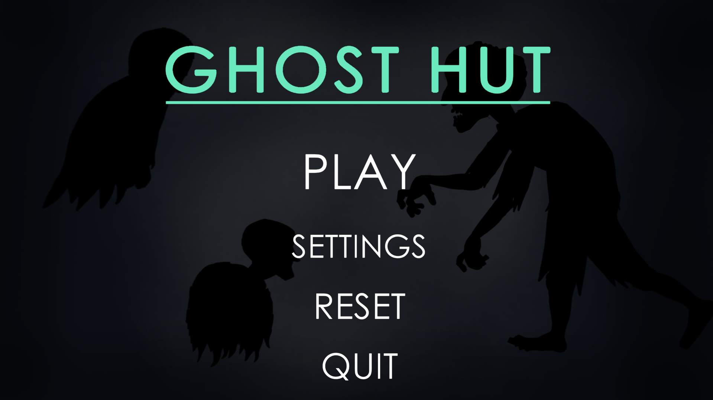
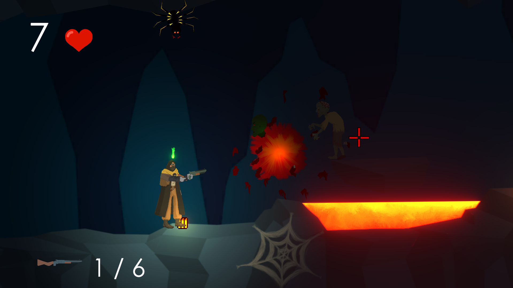
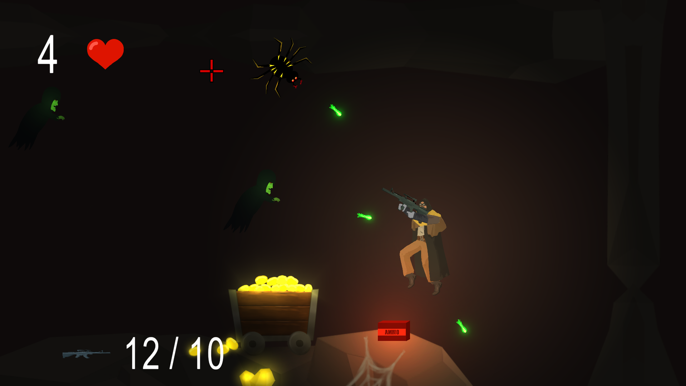
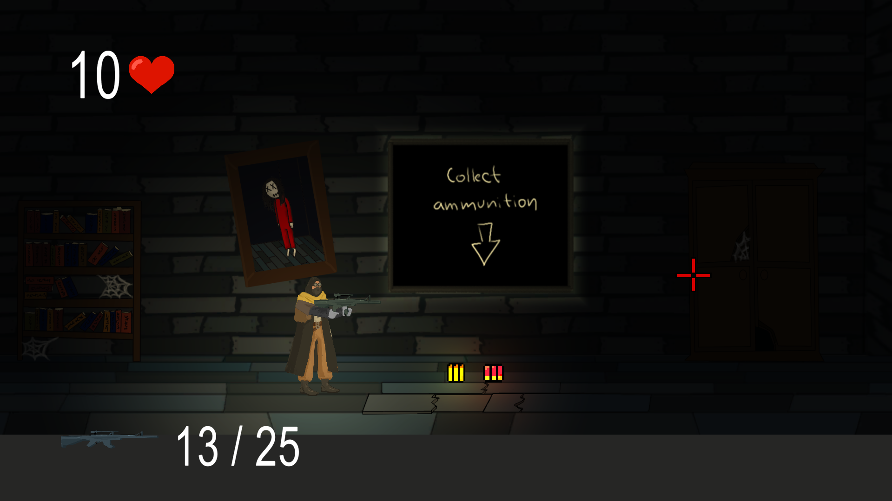

# Chata

Chata is a 2D platformer shooter game developed using the Unity engine and C#.
The goal is to defeat enemies, survive combat encounters, and progress through all levels.

---

## Gameplay Overview

- 2D platformer shooter
- Fight against enemy AI
- Use different weapons to eliminate enemies
- Complete all levels to finish the game

---

## Screenshots

| Home Screen | Gameplay |
| :---: | :---: |
|  |  |

| Combat | Level |
| :---: | :---: |
|  |  |

---

## Key Features

- **3 Playable Levels**
- **3 Different Weapons**
- **Enemy AI** with basic combat behavior
- **2D Platformer Movement**

---

## Tech Stack

- **Language:** C#
- **Engine:** Unity

---

## Download & Play

You can download the latest playable build from the **Releases** section:

👉 https://github.com/simonjelinek/chata/releases/tag/v1.0.0
